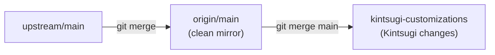

# Fork Sync Strategy for controlplane-helm-templates

## Current State

- **Fork**: `kintsugi-tax/controlplane-helm-templates` (origin)
- **Upstream**: `controlplane-com/templates` (upstream remote already configured)
- **`main` branch**: Clean mirror of `upstream/main` (safe to sync anytime)
- **`kintsugi-customizations` branch**: All Kintsugi-specific changes, regularly merged with `main`

## Goal



- `main` = clean mirror of `upstream/main` (safe to sync anytime)
- `kintsugi-customizations` = all Kintsugi-specific changes, regularly merged with `main`

## Ongoing Sync Workflow (Repeatable)

Run this whenever you want to pull in upstream changes:

```bash
# 1. Update main from upstream
git checkout main
git fetch upstream
git merge upstream/main
git push origin main

# 2. Merge upstream changes into your customizations
git checkout kintsugi-customizations
git merge main
# Resolve any conflicts, then:
git push origin kintsugi-customizations
```

## Important Notes

- **Never commit Kintsugi-specific changes directly to `main`** — always use `kintsugi-customizations`
- **GitHub "Sync fork" button** is safe to use since `main` will be a clean mirror
- When deploying, always deploy from `kintsugi-customizations` (not `main`)
